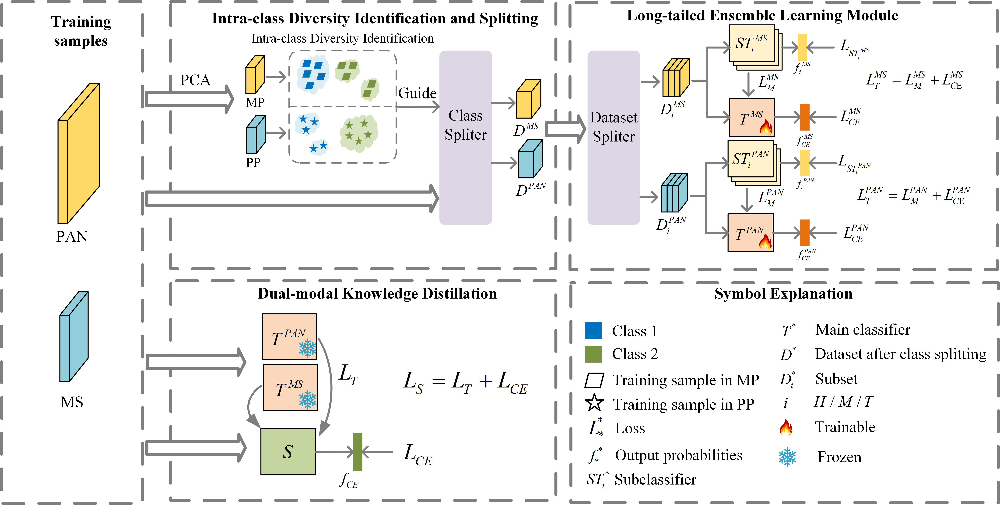
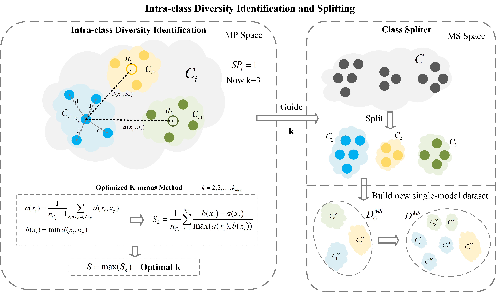
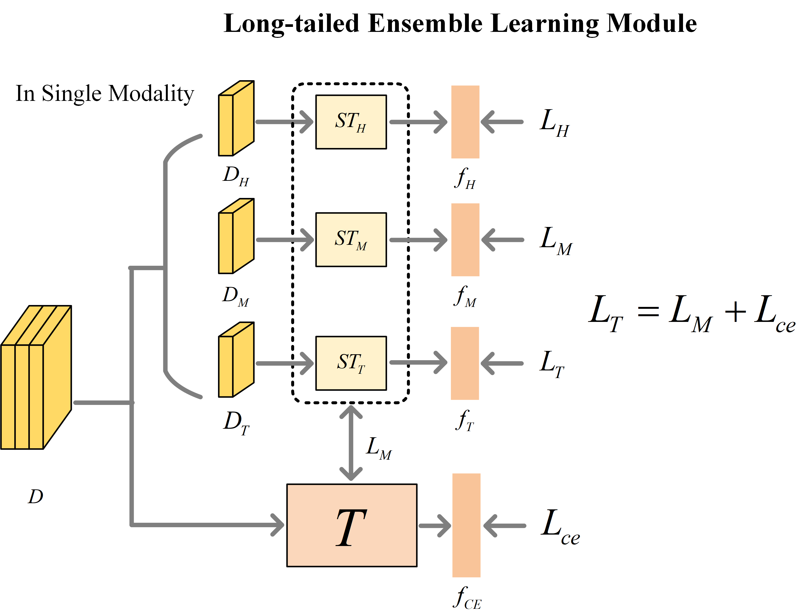
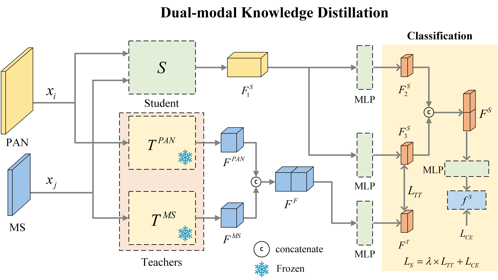

# DEFCNet

A wonderful network you have never seen. Try it!!!


## Overall Architecture




## Intra-class Diversity Identification and Splitting (IDIS)




## Long-Tailed Ensemble Learning Module (LELM)




## Dual-modal Knowledge Distillation (DKD)




## Environment

```python
pip install requirements.txt
```


## How to train and test

```python
python ms_pan.py
#IDIS LELM
python stage2.py
#DKD
```

